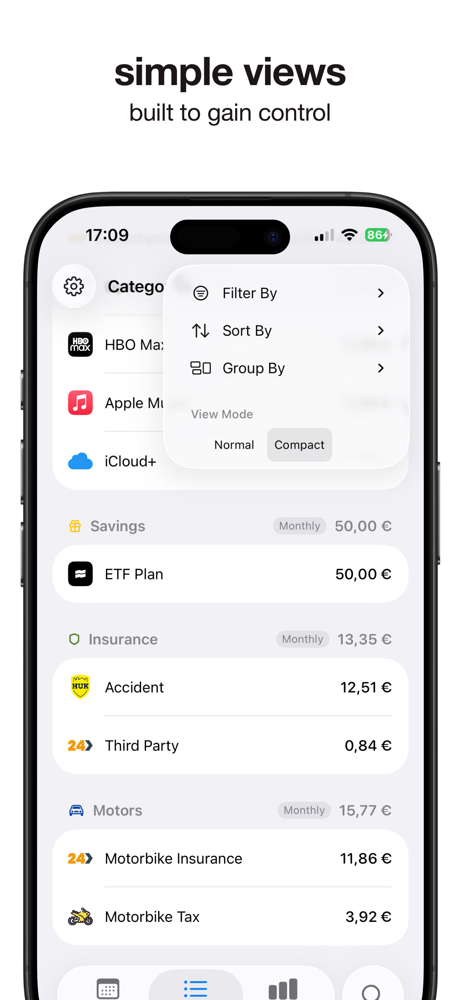
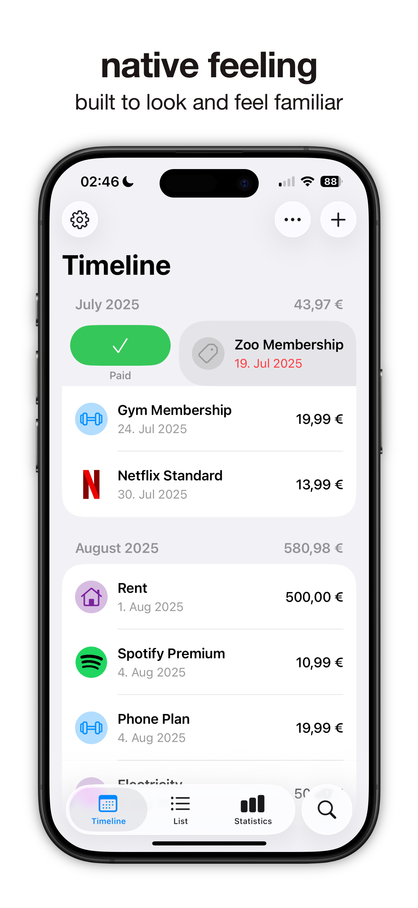
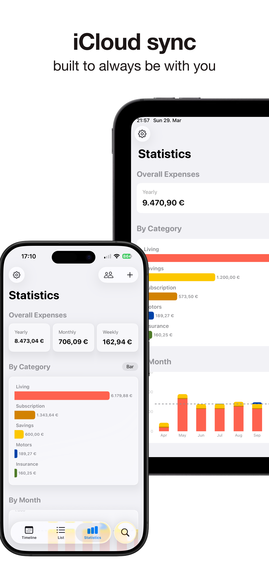
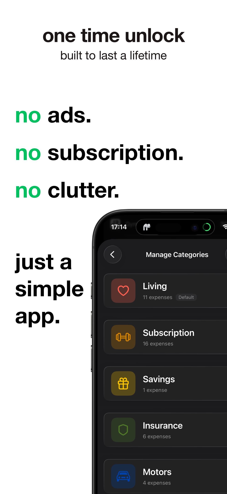

# ClutterFree Expenses

[**Website**](https://mo-geb.com/apps/expenses/)

A simple, native iOS app for keeping track of recurring and one-time expenses. See what you pay per month or year, what's due next, and where your money goes — without the clutter.

  
  
  
  

## Tech stack

- Swift, SwiftUI, SwiftData with iCloud sync (CloudKit)
- Swift Charts
- StoreKit 2 (one-time in-app purchase)
- String Catalogs for localization
- Python script in `Scripts/` for translations (OpenAI / DeepL)

## Building

Open `Kostentracker.xcodeproj` in the latest Xcode and run. To run on a device, set your own team, bundle identifier and iCloud container under *Signing & Capabilities*.

## License

The source code is licensed under the [MIT License](LICENSE).

The app icon, design files, App Store screenshots and the app's name/branding are **not** covered by the MIT License and remain all rights reserved. They're included so the project builds and runs, but may not be reused or redistributed. See [LICENSE](LICENSE) for details.
